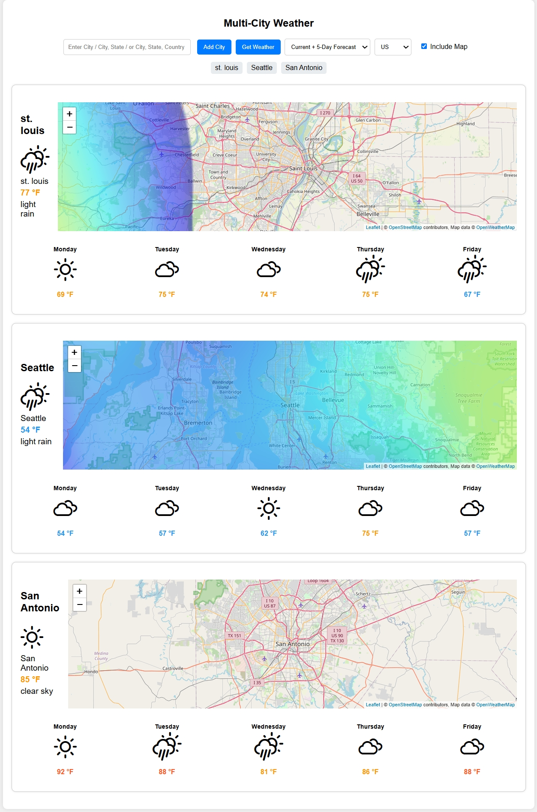

This project is for a browswer widget to display the weather for multiple cities at the same time. I was also using this as a testbed for working with ChatGPT for coding, as I did not know any JavaScript when I started.  There are several things that I know need refactored if this project were to continue any further.

**Example Output:**

